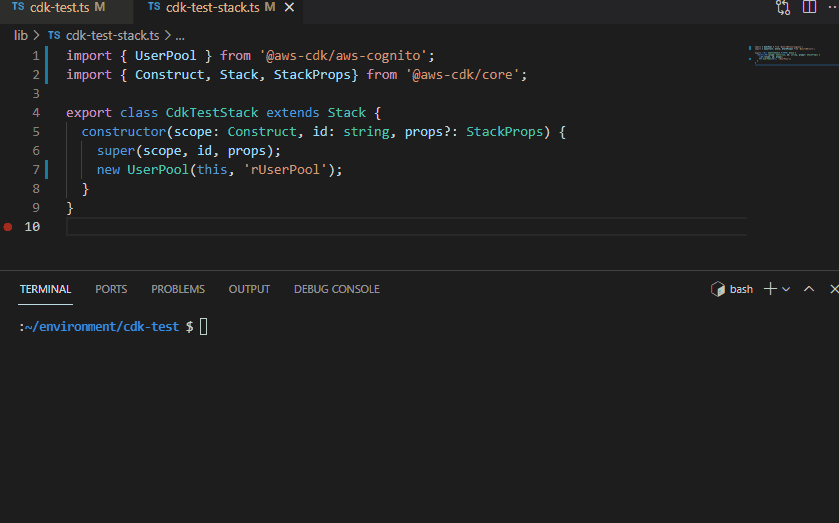

<!--
Copyright Amazon.com, Inc. or its affiliates. All Rights Reserved.
SPDX-License-Identifier: Apache-2.0
-->

# cdk-nag

[](https://pypi.org/project/cdk-nag/)
[](https://www.npmjs.com/package/cdk-nag)
[](https://search.maven.org/search?q=a:cdknag)
[](https://www.nuget.org/packages/Cdklabs.CdkNag)
[](https://github.com/cdklabs/cdk-nag-go)

[](https://constructs.dev/packages/cdk-nag)

Check CDK applications or [CloudFormation templates](#using-on-cloudformation-templates) for best practices using a combination of available rule packs. Inspired by [cfn_nag](https://github.com/stelligent/cfn_nag).

Check out [this blog post](https://aws.amazon.com/blogs/devops/manage-application-security-and-compliance-with-the-aws-cloud-development-kit-and-cdk-nag/) for a guided overview!



## Available Rules and Packs

See [RULES](./RULES.md) for more information on all the available packs.

1. [AWS Solutions](./RULES.md#awssolutions)
2. [HIPAA Security](./RULES.md#hipaa-security)
3. [NIST 800-53 rev 4](./RULES.md#nist-800-53-rev-4)
4. [NIST 800-53 rev 5](./RULES.md#nist-800-53-rev-5)
5. [PCI DSS 3.2.1](./RULES.md#pci-dss-321)

[RULES](./RULES.md) also includes a collection of [additional rules](./RULES.md#additional-rules) that are not currently included in any of the pre-built NagPacks, but are still available for inclusion in custom NagPacks.

Read the [NagPack developer docs](./docs/NagPack.md) if you are interested in creating your own pack.

## Usage

For a full list of options See `NagPackProps` in the [API.md](./API.md#struct-nagpackprops)

<details>
<summary>Including in an application</summary>

```typescript
import { App, Aspects } from 'aws-cdk-lib';
import { CdkTestStack } from '../lib/cdk-test-stack';
import { AwsSolutionsChecks } from 'cdk-nag';

const app = new App();
new CdkTestStack(app, 'CdkNagDemo');
// Simple rule informational messages
Aspects.of(app).add(new AwsSolutionsChecks());
// Additional explanations on the purpose of triggered rules
// Aspects.of(stack).add(new AwsSolutionsChecks({ verbose: true }));
```

</details>

## Suppressing a Rule

<details>
  <summary>Example 1) Default Construct</summary>

```typescript
import { SecurityGroup, Vpc, Peer, Port } from 'aws-cdk-lib/aws-ec2';
import { Stack, StackProps } from 'aws-cdk-lib';
import { Construct } from 'constructs';
import { NagSuppressions } from 'cdk-nag';

export class CdkTestStack extends Stack {
  constructor(scope: Construct, id: string, props?: StackProps) {
    super(scope, id, props);
    const test = new SecurityGroup(this, 'test', {
      vpc: new Vpc(this, 'vpc'),
    });
    test.addIngressRule(Peer.anyIpv4(), Port.allTraffic());
    NagSuppressions.addResourceSuppressions(test, [
      { id: 'AwsSolutions-EC23', reason: 'lorem ipsum' },
    ]);
  }
}
```

</details>

<details>
  <summary>Example 2) On Multiple Constructs</summary>

```typescript
import { SecurityGroup, Vpc, Peer, Port } from 'aws-cdk-lib/aws-ec2';
import { Stack, StackProps } from 'aws-cdk-lib';
import { Construct } from 'constructs';
import { NagSuppressions } from 'cdk-nag';

export class CdkTestStack extends Stack {
  constructor(scope: Construct, id: string, props?: StackProps) {
    super(scope, id, props);
    const vpc = new Vpc(this, 'vpc');
    const test1 = new SecurityGroup(this, 'test', { vpc });
    test1.addIngressRule(Peer.anyIpv4(), Port.allTraffic());
    const test2 = new SecurityGroup(this, 'test', { vpc });
    test2.addIngressRule(Peer.anyIpv4(), Port.allTraffic());
    NagSuppressions.addResourceSuppressions(
      [test1, test2],
      [{ id: 'AwsSolutions-EC23', reason: 'lorem ipsum' }]
    );
  }
}
```

</details>

<details>
  <summary>Example 3) Child Constructs</summary>

```typescript
import { User, PolicyStatement } from 'aws-cdk-lib/aws-iam';
import { Stack, StackProps } from 'aws-cdk-lib';
import { Construct } from 'constructs';
import { NagSuppressions } from 'cdk-nag';

export class CdkTestStack extends Stack {
  constructor(scope: Construct, id: string, props?: StackProps) {
    super(scope, id, props);
    const user = new User(this, 'rUser');
    user.addToPolicy(
      new PolicyStatement({
        actions: ['s3:PutObject'],
        resources: ['arn:aws:s3:::bucket_name/*'],
      })
    );
    // Enable adding suppressions to child constructs
    NagSuppressions.addResourceSuppressions(
      user,
      [
        {
          id: 'AwsSolutions-IAM5',
          reason: 'lorem ipsum',
          appliesTo: ['Resource::arn:aws:s3:::bucket_name/*'], // optional
        },
      ],
      true
    );
  }
}
```

</details>

<details>
  <summary>Example 4) Stack Level </summary>

```typescript
import { App, Aspects } from 'aws-cdk-lib';
import { CdkTestStack } from '../lib/cdk-test-stack';
import { AwsSolutionsChecks, NagSuppressions } from 'cdk-nag';

const app = new App();
const stack = new CdkTestStack(app, 'CdkNagDemo');
Aspects.of(app).add(new AwsSolutionsChecks());
NagSuppressions.addStackSuppressions(stack, [
  { id: 'AwsSolutions-EC23', reason: 'lorem ipsum' },
]);
```

</details>

<details>
  <summary>Example 5) Construct path</summary>

If you received the following error on synth/deploy

```bash
[Error at /StackName/Custom::CDKBucketDeployment8675309/ServiceRole/Resource] AwsSolutions-IAM4: The IAM user, role, or group uses AWS managed policies
```

```typescript
import { Bucket } from 'aws-cdk-lib/aws-s3';
import { BucketDeployment } from 'aws-cdk-lib/aws-s3-deployment';
import { Stack, StackProps } from 'aws-cdk-lib';
import { Construct } from 'constructs';
import { NagSuppressions } from 'cdk-nag';

export class CdkTestStack extends Stack {
  constructor(scope: Construct, id: string, props?: StackProps) {
    super(scope, id, props);
    new BucketDeployment(this, 'rDeployment', {
      sources: [],
      destinationBucket: Bucket.fromBucketName(this, 'rBucket', 'foo'),
    });
    NagSuppressions.addResourceSuppressionsByPath(
      this,
      '/StackName/Custom::CDKBucketDeployment8675309/ServiceRole/Resource',
      [{ id: 'AwsSolutions-IAM4', reason: 'at least 10 characters' }]
    );
  }
}
```

</details>

<details>
  <summary>Example 6) Granular Suppressions of findings</summary>

Certain rules support granular suppressions of `findings`. If you received the following errors on synth/deploy

```bash
[Error at /StackName/rFirstUser/DefaultPolicy/Resource] AwsSolutions-IAM5[Action::s3:*]: The IAM entity contains wildcard permissions and does not have a cdk-nag rule suppression with evidence for those permission.
[Error at /StackName/rFirstUser/DefaultPolicy/Resource] AwsSolutions-IAM5[Resource::*]: The IAM entity contains wildcard permissions and does not have a cdk-nag rule suppression with evidence for those permission.
[Error at /StackName/rSecondUser/DefaultPolicy/Resource] AwsSolutions-IAM5[Action::s3:*]: The IAM entity contains wildcard permissions and does not have a cdk-nag rule suppression with evidence for those permission.
[Error at /StackName/rSecondUser/DefaultPolicy/Resource] AwsSolutions-IAM5[Resource::*]: The IAM entity contains wildcard permissions and does not have a cdk-nag rule suppression with evidence for those permission.
```

By applying the following suppressions

```typescript
import { User } from 'aws-cdk-lib/aws-iam';
import { Stack, StackProps } from 'aws-cdk-lib';
import { Construct } from 'constructs';
import { NagSuppressions } from 'cdk-nag';

export class CdkTestStack extends Stack {
  constructor(scope: Construct, id: string, props?: StackProps) {
    super(scope, id, props);
    const firstUser = new User(this, 'rFirstUser');
    firstUser.addToPolicy(
      new PolicyStatement({
        actions: ['s3:*'],
        resources: ['*'],
      })
    );
    const secondUser = new User(this, 'rSecondUser');
    secondUser.addToPolicy(
      new PolicyStatement({
        actions: ['s3:*'],
        resources: ['*'],
      })
    );
    const thirdUser = new User(this, 'rSecondUser');
    thirdUser.addToPolicy(
      new PolicyStatement({
        actions: ['sqs:CreateQueue'],
        resources: [`arn:aws:sqs:${this.region}:${this.account}:*`],
      })
    );
    NagSuppressions.addResourceSuppressions(
      firstUser,
      [
        {
          id: 'AwsSolutions-IAM5',
          reason:
            "Only suppress AwsSolutions-IAM5 's3:*' finding on First User.",
          appliesTo: ['Action::s3:*'],
        },
      ],
      true
    );
    NagSuppressions.addResourceSuppressions(
      secondUser,
      [
        {
          id: 'AwsSolutions-IAM5',
          reason: 'Suppress all AwsSolutions-IAM5 findings on Second User.',
        },
      ],
      true
    );
    NagSuppressions.addResourceSuppressions(
      thirdUser,
      [
        {
          id: 'AwsSolutions-IAM5',
          reason: 'Suppress AwsSolutions-IAM5 on the SQS resource.',
          appliesTo: [
            {
              regex: '/^Resource::arn:aws:sqs:(.*):\\*$/g',
            },
          ],
        },
      ],
      true
    );
  }
}
```

You would see the following error on synth/deploy

```bash
[Error at /StackName/rFirstUser/DefaultPolicy/Resource] AwsSolutions-IAM5[Resource::*]: The IAM entity contains wildcard permissions and does not have a cdk-nag rule suppression with evidence for those permission.
```

</details>

## Suppressing `aws-cdk-lib/pipelines` Violations

The [aws-cdk-lib/pipelines.CodePipeline](https://docs.aws.amazon.com/cdk/api/v2/docs/aws-cdk-lib.pipelines.CodePipeline.html) construct and its child constructs are not guaranteed to be "Visited" by `Aspects`, as they are not added during the "Construction" phase of the [cdk lifecycle](https://docs.aws.amazon.com/cdk/v2/guide/apps.html#lifecycle). Because of this behavior, you may experience problems such as rule violations not appearing or the inability to suppress violations on these constructs.

You can remediate these rule violation and suppression problems by forcing the pipeline construct creation forward by calling `.buildPipeline()` on your `CodePipeline` object. Otherwise you may see errors such as:

```
Error: Suppression path "/this/construct/path" did not match any resource. This can occur when a resource does not exist or if a suppression is applied before a resource is created.
```

See [this issue](https://github.com/aws/aws-cdk/issues/18440) for more information.

<details>
  <summary>Example) Supressing Violations in Pipelines</summary>

`example-app.ts`

```ts
import { App, Aspects } from 'aws-cdk-lib';
import { AwsSolutionsChecks } from 'cdk-nag';
import { ExamplePipeline } from '../lib/example-pipeline';

const app = new App();
new ExamplePipeline(app, 'example-cdk-pipeline');
Aspects.of(app).add(new AwsSolutionsChecks({ verbose: true }));
app.synth();
```

`example-pipeline.ts`

```ts
import { Stack, StackProps } from 'aws-cdk-lib';
import { Repository } from 'aws-cdk-lib/aws-codecommit';
import {
  CodePipeline,
  CodePipelineSource,
  ShellStep,
} from 'aws-cdk-lib/pipelines';
import { NagSuppressions } from 'cdk-nag';
import { Construct } from 'constructs';

export class ExamplePipeline extends Stack {
  constructor(scope: Construct, id: string, props?: StackProps) {
    super(scope, id, props);

    const exampleSynth = new ShellStep('ExampleSynth', {
      commands: ['yarn build --frozen-lockfile'],
      input: CodePipelineSource.codeCommit(
        new Repository(this, 'ExampleRepo', { repositoryName: 'ExampleRepo' }),
        'main'
      ),
    });

    const ExamplePipeline = new CodePipeline(this, 'ExamplePipeline', {
      synth: exampleSynth,
    });

    // Force the pipeline construct creation forward before applying suppressions.
    // @See https://github.com/aws/aws-cdk/issues/18440
    ExamplePipeline.buildPipeline();

    // The path suppression will error if you comment out "ExamplePipeline.buildPipeline();""
    NagSuppressions.addResourceSuppressionsByPath(
      this,
      '/example-cdk-pipeline/ExamplePipeline/Pipeline/ArtifactsBucket/Resource',
      [
        {
          id: 'AwsSolutions-S1',
          reason: 'Because I said so',
        },
      ]
    );
  }
}
```

</details>

## Rules and Property Overrides

In some cases L2 Constructs do not have a native option to remediate an issue and must be fixed via [Raw Overrides](https://docs.aws.amazon.com/cdk/latest/guide/cfn_layer.html#cfn_layer_raw). Since raw overrides take place after template synthesis these fixes are not caught by cdk-nag. In this case you should remediate the issue and suppress the issue like in the following example.

<details>
  <summary>Example) Property Overrides</summary>

```ts
import {
  Instance,
  InstanceType,
  InstanceClass,
  MachineImage,
  Vpc,
  CfnInstance,
} from 'aws-cdk-lib/aws-ec2';
import { Stack, StackProps } from 'aws-cdk-lib';
import { Construct } from 'constructs';
import { NagSuppressions } from 'cdk-nag';

export class CdkTestStack extends Stack {
  constructor(scope: Construct, id: string, props?: StackProps) {
    super(scope, id, props);
    const instance = new Instance(this, 'rInstance', {
      vpc: new Vpc(this, 'rVpc'),
      instanceType: new InstanceType(InstanceClass.T3),
      machineImage: MachineImage.latestAmazonLinux(),
    });
    const cfnIns = instance.node.defaultChild as CfnInstance;
    cfnIns.addPropertyOverride('DisableApiTermination', true);
    NagSuppressions.addResourceSuppressions(instance, [
      {
        id: 'AwsSolutions-EC29',
        reason: 'Remediated through property override.',
      },
    ]);
  }
}
```

</details>

## Conditionally Ignoring Suppressions

You can optionally create a condition that prevents certain rules from being suppressed. You can create conditions for any variety of reasons. Examples include a condition that always ignores a suppression, a condition that ignores a suppression based on the date, a condition that ignores a suppression based on the reason. You can read [the developer docs](./docs/IgnoreSuppressionConditions.md) for more information on creating your own conditions.

<details>
  <summary>Example) Using the pre-built `SuppressionIgnoreErrors` class to ignore suppressions on any `Error` level rules.</summary>

```ts
import { App, Aspects } from 'aws-cdk-lib';
import { CdkTestStack } from '../lib/cdk-test-stack';
import { AwsSolutionsChecks, SuppressionIgnoreErrors } from 'cdk-nag';

const app = new App();
new CdkTestStack(app, 'CdkNagDemo');
// Ignore Suppressions on any errors
Aspects.of(app).add(
  new AwsSolutionsChecks({
    suppressionIgnoreCondition: new SuppressionIgnoreErrors(),
  })
);
```

</details>

## Customizing Logging

`NagLogger`s give `NagPack` authors and users the ability to create their own custom reporting mechanisms. All pre-built `NagPacks`come with the `AnnotationsLogger`and the `NagReportLogger` (with CSV reports) enabled by default.

See the [NagLogger](./docs/NagLogger.md) developer docs for more information.

<details>
  <summary>Example) Adding the `ExtremelyHelpfulConsoleLogger` example from the NagLogger docs</summary>

```ts
import { App, Aspects } from 'aws-cdk-lib';
import { CdkTestStack } from '../lib/cdk-test-stack';
import { ExtremelyHelpfulConsoleLogger } from './docs/NagLogger';
import { AwsSolutionsChecks } from 'cdk-nag';

const app = new App();
new CdkTestStack(app, 'CdkNagDemo');
Aspects.of(app).add(
  new AwsSolutionsChecks({
    additionalLoggers: [new ExtremelyHelpfulConsoleLogger()],
  })
);
```

</details>

## Using on CloudFormation templates

You can use cdk-nag on existing CloudFormation templates by using the [cloudformation-include](https://docs.aws.amazon.com/cdk/latest/guide/use_cfn_template.html#use_cfn_template_install) module.

<details>
  <summary>Example 1) CloudFormation template with suppression</summary>

Sample CloudFormation template with suppression

```json
{
  "Resources": {
    "rBucket": {
      "Type": "AWS::S3::Bucket",
      "Properties": {
        "BucketName": "some-bucket-name"
      },
      "Metadata": {
        "cdk_nag": {
          "rules_to_suppress": [
            {
              "id": "AwsSolutions-S1",
              "reason": "at least 10 characters"
            }
          ]
        }
      }
    }
  }
}
```

Sample App

```typescript
import { App, Aspects } from 'aws-cdk-lib';
import { CdkTestStack } from '../lib/cdk-test-stack';
import { AwsSolutionsChecks } from 'cdk-nag';

const app = new App();
new CdkTestStack(app, 'CdkNagDemo');
Aspects.of(app).add(new AwsSolutionsChecks());
```

Sample Stack with imported template

```typescript
import { CfnInclude } from 'aws-cdk-lib/cloudformation-include';
import { NagSuppressions } from 'cdk-nag';
import { Stack, StackProps } from 'aws-cdk-lib';
import { Construct } from 'constructs';

export class CdkTestStack extends Stack {
  constructor(scope: Construct, id: string, props?: StackProps) {
    super(scope, id, props);
    new CfnInclude(this, 'Template', {
      templateFile: 'my-template.json',
    });
    // Add any additional suppressions
    NagSuppressions.addResourceSuppressionsByPath(
      this,
      '/CdkNagDemo/Template/rBucket',
      [
        {
          id: 'AwsSolutions-S2',
          reason: 'at least 10 characters',
        },
      ]
    );
  }
}
```

</details>

<details>
  <summary>Example 2) CloudFormation template with granular suppressions</summary>

Sample CloudFormation template with suppression

```json
{
  "Resources": {
    "myPolicy": {
      "Type": "AWS::IAM::Policy",
      "Properties": {
        "PolicyDocument": {
          "Statement": [
            {
              "Action": [
                "kms:Decrypt",
                "kms:DescribeKey",
                "kms:Encrypt",
                "kms:ReEncrypt*",
                "kms:GenerateDataKey*"
              ],
              "Effect": "Allow",
              "Resource": ["some-key-arn"]
            }
          ],
          "Version": "2012-10-17"
        }
      },
      "Metadata": {
        "cdk_nag": {
          "rules_to_suppress": [
            {
              "id": "AwsSolutions-IAM5",
              "reason": "Allow key data access",
              "applies_to": [
                "Action::kms:ReEncrypt*",
                "Action::kms:GenerateDataKey*"
              ]
            }
          ]
        }
      }
    }
  }
}
```

Sample App

```typescript
import { App, Aspects } from 'aws-cdk-lib';
import { CdkTestStack } from '../lib/cdk-test-stack';
import { AwsSolutionsChecks } from 'cdk-nag';

const app = new App();
new CdkTestStack(app, 'CdkNagDemo');
Aspects.of(app).add(new AwsSolutionsChecks());
```

Sample Stack with imported template

```typescript
import { CfnInclude } from 'aws-cdk-lib/cloudformation-include';
import { NagSuppressions } from 'cdk-nag';
import { Stack, StackProps } from 'aws-cdk-lib';
import { Construct } from 'constructs';

export class CdkTestStack extends Stack {
  constructor(scope: Construct, id: string, props?: StackProps) {
    super(scope, id, props);
    new CfnInclude(this, 'Template', {
      templateFile: 'my-template.json',
    });
    // Add any additional suppressions
    NagSuppressions.addResourceSuppressionsByPath(
      this,
      '/CdkNagDemo/Template/myPolicy',
      [
        {
          id: 'AwsSolutions-IAM5',
          reason: 'Allow key data access',
          appliesTo: ['Action::kms:ReEncrypt*', 'Action::kms:GenerateDataKey*'],
        },
      ]
    );
  }
}
```

</details>

## Contributing

See [CONTRIBUTING](./CONTRIBUTING.md) for more information.

## License

This project is licensed under the Apache-2.0 License.
