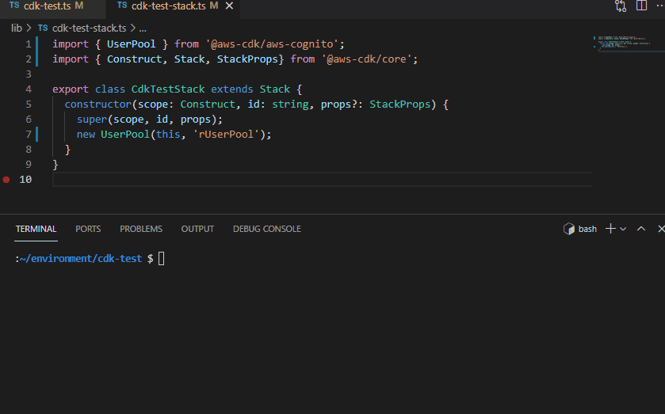

<!--
Copyright Amazon.com, Inc. or its affiliates. All Rights Reserved.
SPDX-License-Identifier: Apache-2.0
-->

# cdk-nag

[](https://pypi.org/project/cdk-nag/)
[](https://www.npmjs.com/package/cdk-nag)
[](https://search.maven.org/search?q=a:cdknag)
[](https://www.nuget.org/packages/Cdklabs.CdkNag)
[](https://github.com/cdklabs/cdk-nag-go)

[](https://constructs.dev/packages/cdk-nag)

Check CDK applications or [CloudFormation templates](#using-on-cloudformation-templates) for best practices using a combination of available rule packs. Inspired by [cfn_nag](https://github.com/stelligent/cfn_nag).

Check out [this blog post](https://aws.amazon.com/blogs/devops/manage-application-security-and-compliance-with-the-aws-cloud-development-kit-and-cdk-nag/) for a guided overview!



## Available Rules and Packs

See [RULES](./RULES.md) for more information on all the available packs.

1. [AWS Solutions](./RULES.md#awssolutions)
2. [HIPAA Security](./RULES.md#hipaa-security)
3. [NIST 800-53 rev 4](./RULES.md#nist-800-53-rev-4)
4. [NIST 800-53 rev 5](./RULES.md#nist-800-53-rev-5)
5. [PCI DSS 3.2.1](./RULES.md#pci-dss-321)
6. [Serverless](./RULES.md#serverless)

[RULES](./RULES.md) also includes a collection of [additional rules](./RULES.md#additional-rules) that are not currently included in any of the pre-built NagPacks, but are still available for inclusion in custom NagPacks.

Read the [NagPack developer docs](./docs/NagPack.md) if you are interested in creating your own pack.

## Usage

For a full list of options See `NagPackProps` in the [API.md](./API.md#struct-nagpackprops)

<details>
<summary>Including in an application</summary>

```typescript
import { App, Aspects } from 'aws-cdk-lib';
import { CdkTestStack } from '../lib/cdk-test-stack';
import { AwsSolutionsChecks } from 'cdk-nag';

const app = new App();
new CdkTestStack(app, 'CdkNagDemo');
// Simple rule informational messages using the AWS Solutions Rule pack
Aspects.of(app).add(new AwsSolutionsChecks());
// Multiple rule packs can be run against the same app
Aspects.of(app).add(new NIST80053R5Checks());
// Additional explanations on the purpose of triggered rules
// Aspects.of(stack).add(new AwsSolutionsChecks({ verbose: true }));
```

</details>

## Acknowledging a Rule

Use CDK's native `Validations.of()` API to acknowledge (suppress) rule violations on specific constructs.

<details>
  <summary>Example 1) Acknowledging a rule on a construct</summary>

```typescript
import { SecurityGroup, Vpc, Peer, Port } from 'aws-cdk-lib/aws-ec2';
import { Stack, StackProps, Validations } from 'aws-cdk-lib';
import { Construct } from 'constructs';

export class CdkTestStack extends Stack {
  constructor(scope: Construct, id: string, props?: StackProps) {
    super(scope, id, props);
    const test = new SecurityGroup(this, 'test', {
      vpc: new Vpc(this, 'vpc'),
    });
    test.addIngressRule(Peer.anyIpv4(), Port.allTraffic());
    Validations.of(test).acknowledge({
      id: 'AwsSolutions-EC23',
      reason: 'This security group is used for internal testing only.',
    });
  }
}
```

</details>

<details>
  <summary>Example 2) Acknowledging a rule on a stack</summary>

```typescript
import { App, Aspects, Validations } from 'aws-cdk-lib';
import { CdkTestStack } from '../lib/cdk-test-stack';
import { AwsSolutionsChecks } from 'cdk-nag';

const app = new App();
const stack = new CdkTestStack(app, 'CdkNagDemo');
Aspects.of(app).add(new AwsSolutionsChecks());
Validations.of(stack).acknowledge({
  id: 'AwsSolutions-EC23',
  reason: 'All security groups in this stack are internal only.',
});
```

</details>

<details>
  <summary>Example 3) Acknowledging a specific finding</summary>

Certain rules report multiple findings per resource (e.g., IAM wildcard permissions). Each finding has its own ID in the format `RuleId[FindingId]`.

If you received the following errors on synth/deploy:

```bash
[Error at /StackName/rUser/DefaultPolicy/Resource] AwsSolutions-IAM5[Action::s3:*]: The IAM entity contains wildcard permissions.
[Error at /StackName/rUser/DefaultPolicy/Resource] AwsSolutions-IAM5[Resource::*]: The IAM entity contains wildcard permissions.
```

You can acknowledge a specific finding:

```typescript
import { User, PolicyStatement } from 'aws-cdk-lib/aws-iam';
import { Stack, StackProps, Validations } from 'aws-cdk-lib';
import { Construct } from 'constructs';

export class CdkTestStack extends Stack {
  constructor(scope: Construct, id: string, props?: StackProps) {
    super(scope, id, props);
    const user = new User(this, 'rUser');
    user.addToPolicy(
      new PolicyStatement({
        actions: ['s3:*'],
        resources: ['*'],
      })
    );
    // Only acknowledge the s3:* action — Resource::* still triggers
    Validations.of(user).acknowledge({
      id: 'AwsSolutions-IAM5[Action::s3:*]',
      reason: 'Need s3:* for cross-account replication.',
    });
  }
}
```

</details>

## Rules and Property Overrides

In some cases L2 Constructs do not have a native option to remediate an issue and must be fixed via [Raw Overrides](https://docs.aws.amazon.com/cdk/latest/guide/cfn_layer.html#cfn_layer_raw). Since raw overrides take place after template synthesis these fixes are not caught by cdk-nag. In this case you should remediate the issue and acknowledge the rule.

<details>
  <summary>Example) Property Overrides</summary>

```ts
import {
  Instance,
  InstanceType,
  InstanceClass,
  MachineImage,
  Vpc,
  CfnInstance,
} from 'aws-cdk-lib/aws-ec2';
import { Stack, StackProps, Validations } from 'aws-cdk-lib';
import { Construct } from 'constructs';

export class CdkTestStack extends Stack {
  constructor(scope: Construct, id: string, props?: StackProps) {
    super(scope, id, props);
    const instance = new Instance(this, 'rInstance', {
      vpc: new Vpc(this, 'rVpc'),
      instanceType: new InstanceType(InstanceClass.T3),
      machineImage: MachineImage.latestAmazonLinux(),
    });
    const cfnIns = instance.node.defaultChild as CfnInstance;
    cfnIns.addPropertyOverride('DisableApiTermination', true);
    Validations.of(instance).acknowledge({
      id: 'AwsSolutions-EC29',
      reason: 'Remediated through property override.',
    });
  }
}
```

</details>

## Customizing Logging

`NagLogger`s give `NagPack` authors and users the ability to create their own custom reporting mechanisms. All pre-built `NagPacks` come with the `AnnotationLogger` and the `NagReportLogger` (with CSV reports) enabled by default.

See the [NagLogger](./docs/NagLogger.md) developer docs for more information.

<details>
  <summary>Example) Adding a custom logger</summary>

```ts
import { App, Aspects } from 'aws-cdk-lib';
import { CdkTestStack } from '../lib/cdk-test-stack';
import { ExtremelyHelpfulConsoleLogger } from './docs/NagLogger';
import { AwsSolutionsChecks } from 'cdk-nag';

const app = new App();
new CdkTestStack(app, 'CdkNagDemo');
Aspects.of(app).add(
  new AwsSolutionsChecks({
    additionalLoggers: [new ExtremelyHelpfulConsoleLogger()],
  })
);
```

</details>

## Using on CloudFormation templates

You can use cdk-nag on existing CloudFormation templates by using the [cloudformation-include](https://docs.aws.amazon.com/cdk/latest/guide/use-cfn-template.html#use-cfn-template-import) module.

<details>
  <summary>Example) CloudFormation template</summary>

Sample App

```typescript
import { App, Aspects } from 'aws-cdk-lib';
import { CdkTestStack } from '../lib/cdk-test-stack';
import { AwsSolutionsChecks } from 'cdk-nag';

const app = new App();
new CdkTestStack(app, 'CdkNagDemo');
Aspects.of(app).add(new AwsSolutionsChecks());
```

Sample Stack with imported template

```typescript
import { CfnInclude } from 'aws-cdk-lib/cloudformation-include';
import { Stack, StackProps, Validations } from 'aws-cdk-lib';
import { Construct } from 'constructs';

export class CdkTestStack extends Stack {
  constructor(scope: Construct, id: string, props?: StackProps) {
    super(scope, id, props);
    const template = new CfnInclude(this, 'Template', {
      templateFile: 'my-template.json',
    });
    // Acknowledge rules on imported resources
    const bucket = template.getResource('rBucket');
    Validations.of(bucket).acknowledge({
      id: 'AwsSolutions-S1',
      reason: 'Logging not required for this bucket.',
    });
  }
}
```

</details>

## Migrating from v2

cdk-nag v3 replaces the custom `NagSuppressions` API with CDK's native `Validations.of().acknowledge()` mechanism.

| v2 | v3 |
|---|---|
| `NagSuppressions.addResourceSuppressions(construct, [{ id, reason }])` | `Validations.of(construct).acknowledge({ id, reason })` |
| `NagSuppressions.addStackSuppressions(stack, [{ id, reason }])` | `Validations.of(stack).acknowledge({ id, reason })` |
| `NagSuppressions.addResourceSuppressionsByPath(stack, path, [...])` | `Validations.of(construct).acknowledge({ id, reason })` |
| `appliesTo: ['Action::s3:*']` | `id: 'AwsSolutions-IAM5[Action::s3:*]'` |
| `{ id: 'CdkNagValidationFailure', reason: '...' }` | `Validations.of(construct).acknowledge({ id: 'RuleId', reason: '...' })` |

**Note on bulk suppression:** In v2, suppressing a rule without `appliesTo` would suppress all findings for that rule on the construct. In v3, each finding must be acknowledged individually (e.g., `AwsSolutions-IAM5[Action::s3:*]` and `AwsSolutions-IAM5[Resource::*]` are separate acknowledgments). Prefix matching (acknowledging `AwsSolutions-IAM5` to suppress all findings) is not yet supported — tracked via [issue link].

**Removed APIs:**
- `NagSuppressions` (use `Validations.of().acknowledge()`)
- `INagSuppressionIgnore` and all condition classes
- `NagPackSuppression` interface
- `CdkNagValidationFailure` concept
- `logIgnores` and `suppressionIgnoreCondition` props

## Contributing

See [CONTRIBUTING](./CONTRIBUTING.md) for more information.

## License

This project is licensed under the Apache-2.0 License.
